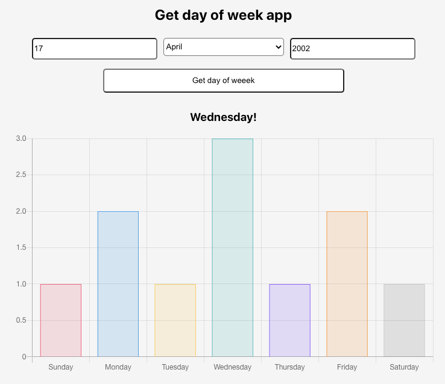

## Docker final exercise - app to check day of week for given date
- Node.js (Express) backend
- PostgreSQL
- Redis (cache)
- Frontend in React.js

### To start:
1. `docker-compose up –-build`
2. Check port 8080 in your browser

### To stop:
1. `docker-compose down`
